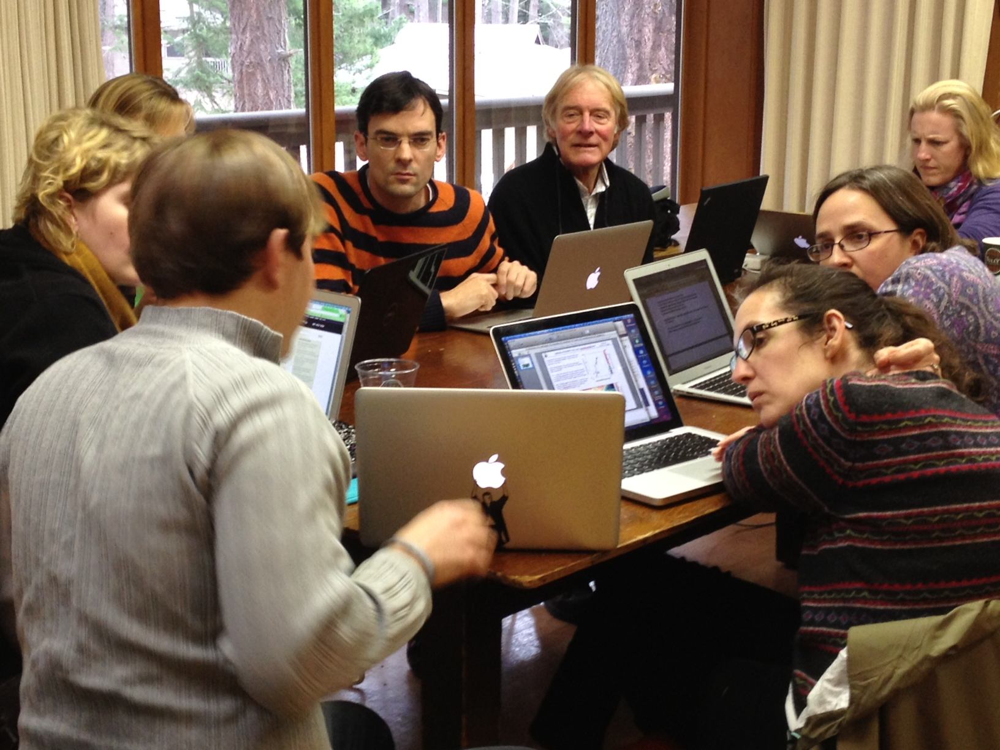

# The Data Science Incubator

Increasingly, science is a data-driven endeavor.  Scientists have access to
phenomenal amounts of data, but they often lack the requisite skills to make
sense of data at scale.  Data scientists understand the \"lay of the land\" of
big data analytics, including techniques for querying, visualizing, storing,
sharing, and data mining.  However, data scientists lack insight into 
scientific problem domains.

The goal of the Data Science Incubator is to bring together data scientists with 
domain scientists to advance the state of the art in science.  We leverage state
of the art tools like [Hadoop](http://hadoop.apache.org),
[GraphLab](http://graphlab.org), and [Myria](http://myria-web.appspot.com) to
help researchers make sense of data at scale.  Because science is a
collaborative process, we place an emphasis on making all of our work available
on the web.

The Data Science Incubator works on the principle of direct collaboration.
During the lifetime of the project, researchers will directly engage with our
team of data scientists, either in our office (currently, Sieg 326) or at
another location.  We have found this style of \"hands-on-keyboards\"
collaboration to be invaluable, as it facillitates rapid knowledge transfer
between domain scientists and data scientists.

Our team has a strong track record of building systems that get real use.  See
[this page](http://escience.washington.edu/what-we-do/projects) for a
description of our success stories.

## How to Get Started

Do you have interesting data challenges?  A good first step is to setup an
initial consultation by [contacting us](mailto:info@escience.washington.edu).
Include the phrase \"incubator\" in the subject line.

After an initial meeting, you can submit a short proposal to the [eScience
institute](mailto:info@escience.washington.edu). A proposal should contain the
following information:

* Contact information.

* Project summary / objective.

* A description of your data: data size, formats, where the data currently
  resides, etc.
 
* The challenges you face; in other words, what do you need help with?

* The timeframe for your work.

* A list of people who will be directly collaborating with us.

A sample proposal is available [here](sample.html).

The proposal undergoes a review process from the [eScience steering
committee](http://escience.washington.edu/who-we-are/steering-committee).  The
ideal proposal has both scientic merit and technical (data science) merit.

Note that seed grants are available for short-term projects.  Contact us for
more details.

## Who we are

* [Bill Howe](http://homes.cs.washington.edu/~billhowe/)
* [Dan Halperin](http://homes.cs.washington.edu/~dhalperi/)
* [Andrew Whitaker](http://homes.cs.washington.edu/~whitaker)
